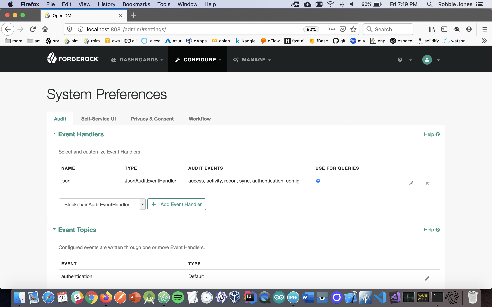
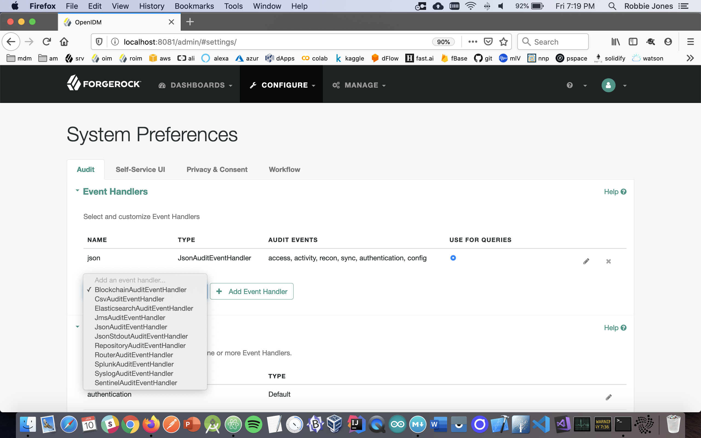
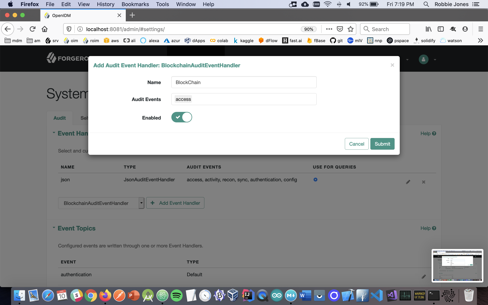
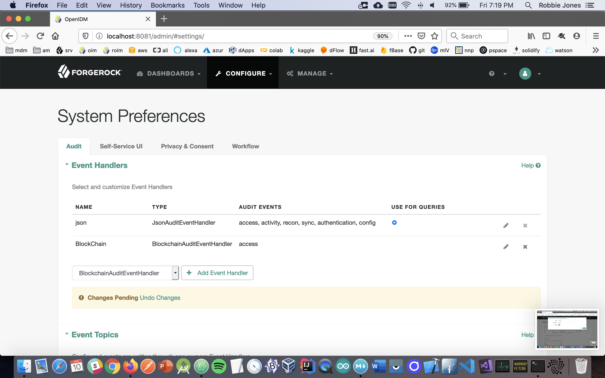
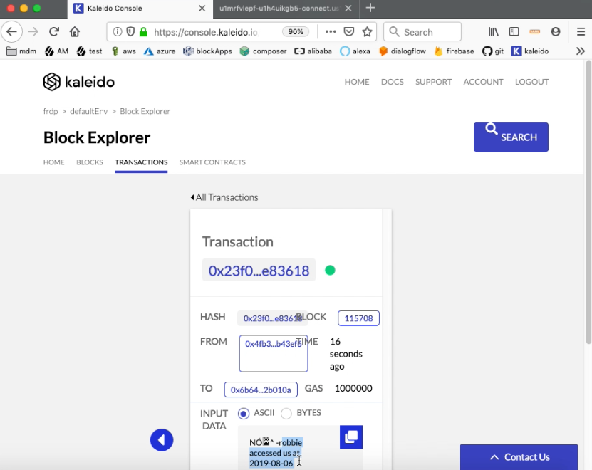

## The Chain + ForgeRock Common Audit (CAUD)

No matter your motivations to store your IAM data on a BlockChain, the event hander published here greatly simplifies the 'plumbing' required by providing a zero-code/configuration-only framework. In other words by using this ForgeRock audit event handler you too can start storing your [ForgeRock](https://forgerock.com) data on The Chain.

(If you are not familiar with the [CAUD](https://www.forgerock.com/platform/common-services/common-audit) it is a framework for audit event handlers that are plugged in to our individual products. The handlers record events, logging them for example into files, relational databases, syslog, and now thanks to this repository the [BlockChain](https://www.forgerock.com/blog/blockchain-distributed-ledger-technology-dlt)).

The instructions for configuring the CAUD vary slightly from product to product; in the interest of simplicity the below is for openidm running on Ubuntu. But the instructions for configuring a BlockChain vary tremendously from chain to chain thus in the interest of simplicity the below uses the enterprise-friendly BlockChain-as-a-Service from [Kaleido](http://Kaleido.io), a [ConsenSys](http://ConsenSys.com) company.

#### Steps to build
- download or clone this repo
- insert your Kaleido values (see section below) at line 19-22 of BlockchainUtils.java
- run 'mvn clean package -DskipTests' from this same level directory
- if any dependency checks fail, verify your credentials used to access backstage.forgerock.com

##### Steps to configure on openidm machine
- stop openidm if it is running
- copy the forgerock-audit-handler-blockchain-1.0.0.jar file that you just used maven to build to your openidm/bundle directory
- add to your openidm/conf/audit.json the entry "org.forgerock.audit.handlers.blockchain.BlockchainAuditEventHandler" to the existing "availableAuditEventHandlers" field
- restart openidm

##### Steps to configure in openidm UI
- navigate to http://yourhost:8080/admin/#settings/ in order to configure your System Preferences

- from the pull down next to 'add event handler' select the **BlockChain** one
 

- click on the button 'add event handler'; in the ensuing dialog, give it a unique name and all the audit events you want sent to the Chain (ie, 'access') and toggle the 'enabled' radio button

- note the 'pending changes' banner, so scroll to the bottom and click 'Save'

#### Steps to configure in Kaleido.io
 - [sign up](https://docs.kaleido.io/using-kaleido/quick-start/create-an-account) for an account
 - follow their [Quick Start](https://docs.kaleido.io/using-kaleido/quick-start/create-your-first-blockchain-network) 
 - deploy a sample [Smart Contract](https://docs.kaleido.io/using-kaleido/quick-start/deploy-invoke-query) that handles storing your IAM data to their hosted BlockChain
 - update line 19-22 of BlockchainUtils.java with the 'server', 'key', 'from', 'to' values from this example 

#### Steps to verify the above is working
- to verify that your messages are being mined on the chain, log in or log out of openidm, and then check the latest transaction in the Block Explorer in Kaleido 

